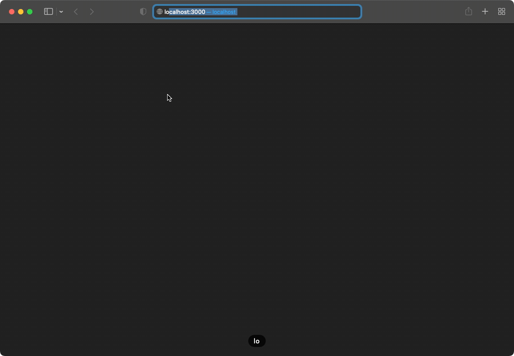
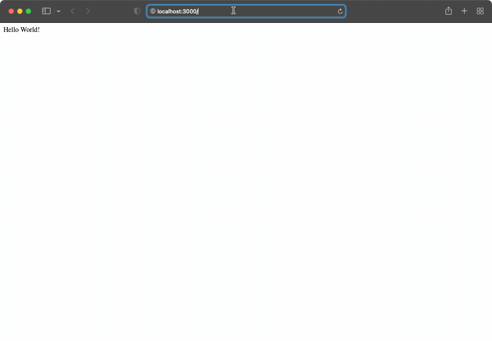
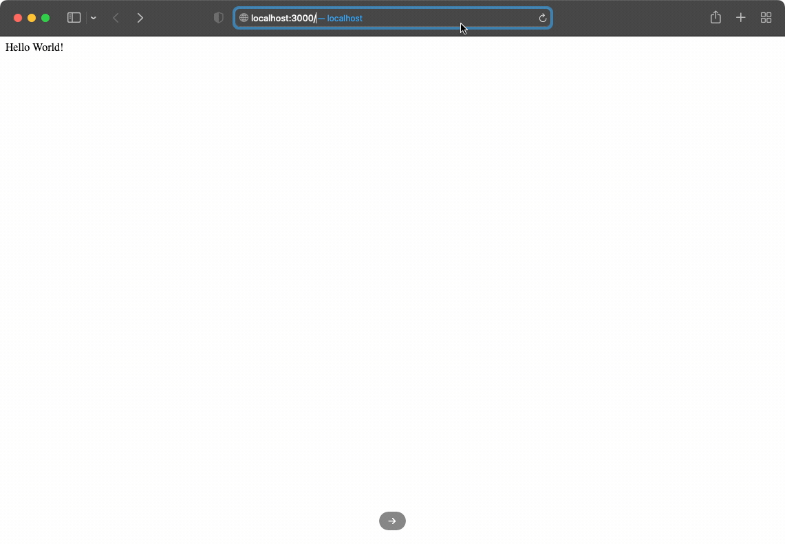

# ⭐️ Basic Express Server - LaunchX

Requerimientos

```markdown

Basic example about express server and it's routes

```

### Dependencies

*Dependencies*

* Express

**Scripts**

* npm start - to run express Server

### Routes

| Route                    | expected                       | output                                             |
| ------------------------ | ------------------------------ | -------------------------------------------------- |
| /                        | "Hello World!"                 |  |
| /launchX                 | "Bienvenidos a LaunchX"        |  |
| /explorersInNode         | {name:"Explorer", msg:"Hello"} |  |
| /explorers/:explorerName | {"explorerName":[param]}       |  |
